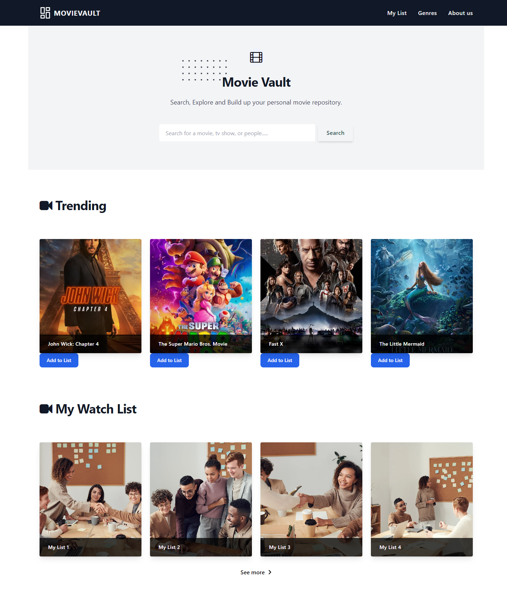
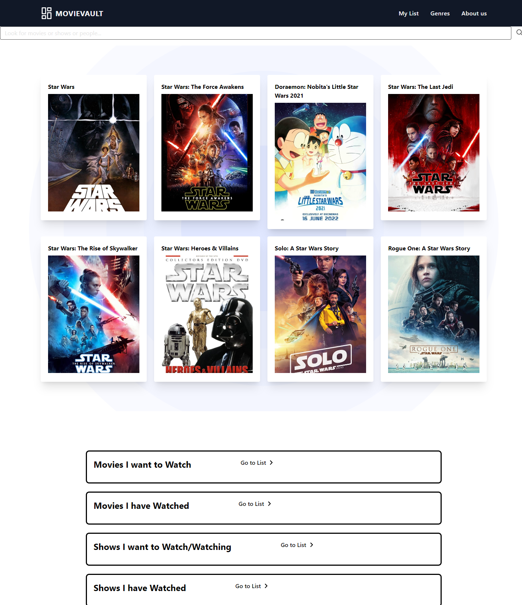
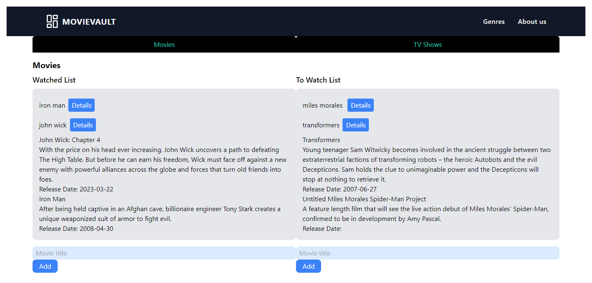

# MovieVault-Project

## Technologies Used
API #1: TMDB API

---
API #2: Pexels

---
JQuery

---
Tailwind

---
Flowbite

---
Font Awesome

## Project Details
In this project Ying, Faizan, and Elias worked together to create a webpage that allows users to track their favorite and future films. We wanted to create a webpage for users to come and find different movies and shows then add any movie or show of there choice to their own local list. On the main page they are shown the search bar and then a small list of currently trending movies. On this page they can go straight to their list page or search for any movie or show they might want. Then there are taken to a page with possible search results. On this page they can then go their list and add any show or movie they want.

## Project Images

---

---

---

---

---

---

## Live Page
https://elias-montes.github.io/MovieVault-Project/